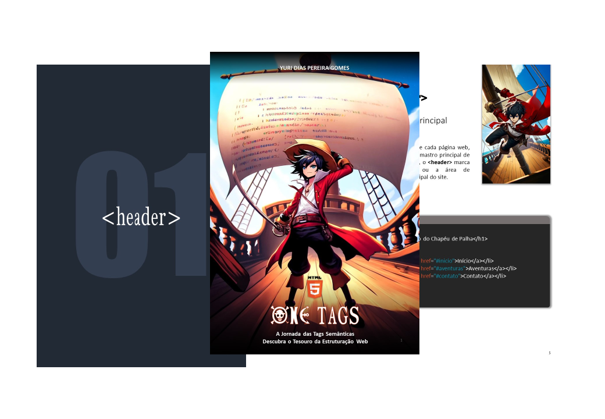

# Projeto EBOOK Gerado por I.A.s

 > ℹ️ **NOTE:** Este repositório foi desenvolvido durante o curso Santander 2024 - Fundamentos de IA para Devs da [DIO](https://dio.me) no qual [Felipe Silva Aguiar](https://github.com/felipeAguiarCode) foi instrutor técnico.

Projeto com o objetivo de gerar um ebook digital com as facilidades das ferramentas de IA. todos os prompts
seguem abaixo.

<a href="https://github.com/yuridiasp/prompts-recipe-to-create-a-ebook/blob/main/output/ebook%20-%20one%20tags%20-%20output.pdf" title="View PDF now"> 📕Clique aqui para ler</a>

## 💻 Tecnologias utilizadas no projeto

- [ChatGPT](https://chat.openai.com/)
- [Dall-e (Chatgpt)](https://openai.com/index/dall-e-2)
- [PowerPoint](https://www.microsoft.com/en/microsoft-365/powerpoint)

## 🧠 Prompts

ChatGPT：

|   Ação   | prompt                                                                                                                                                                                                                                                                         |
| :------: | ------------------------------------------------------------------------------------------------------------------------------------------------------------------------------------------------------------------------------------------------------------------------------ |
|  título  | Crie um título de um ebook sobre o tema de HTML Semântico, o ebookk é do nicho de programação e o subnicho é de HTML, o título deve ser épico e curto, e tenha uma temática de One Piece no título, me liste 5 variações de títulos                                                        |
| conteúdo | Faça um texto para ebook, com foco em HTML, listando as principais tags semanticas com exemplos em código {REGRAS} > Explique sempre de uma maneira simples
> Deixe o texto enxuto > Sempre traga exemplos de código em contextos reais > Sempre deixe um titulo sugestivo por tópico |

Dall-e (Chatgpt)：

|  Ação  | prompt                                                                                 |
| :----: | -------------------------------------------------------------------------------------- |
| título | Gere uma ilustração de um personagem fictício, baseado em uma história de aventura e navegação pirata, semelhante ao Luffy de One Piece. |

## ✨ Features

- Conteúdo gerado via ChatGPT
- Imagens geradas via Dall-e

## 📚 Materiais

- Imagens utilizadas em `assets`
- ebook gerado em `output`

## 🛠️ Instruções de execução

Utilize os prompts acima nas ferramentas sugeridas para gerar o material base e utilize uma ferramenta de edição de documentos como power point, libreoffice , indesign para diagramação.

## 👨‍💻 Desenvolvedor

    
  

    
&nbsp&nbspYuri Dias 
    &nbsp&nbsp&nbsp
    

 

     
